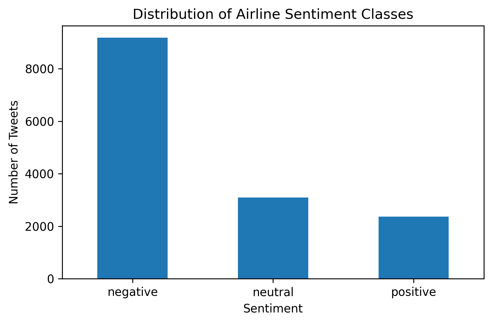
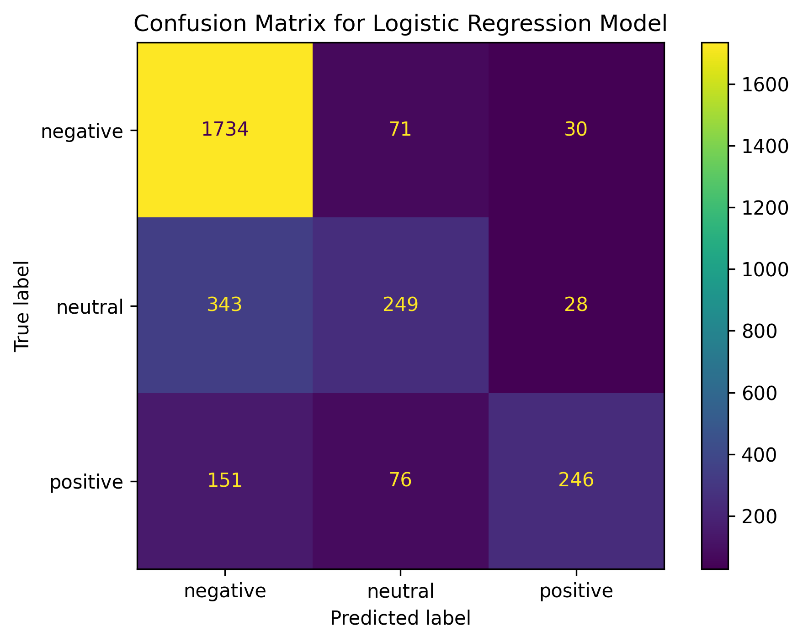

# Social Media Sentiment Analysis

## Overview
This project applies Natural Language Processing (NLP) and Machine Learning techniques to classify airline-related tweets into positive, negative, and neutral sentiment categories.

## Dataset
Twitter US Airline Sentiment Dataset

The dataset contains tweets related to major US airlines and their associated sentiment labels.

## Methods
The following steps were applied in this project:

- Text preprocessing
- Text cleaning
- TF-IDF vectorization
- Logistic Regression classification

## Results
The Logistic Regression model achieved approximately 76% classification accuracy.

Evaluation metrics included:
- Accuracy
- Precision
- Recall
- F1-score
- Confusion Matrix

## Results Interpretation

The Logistic Regression model achieved approximately 76% classification accuracy on the airline tweet sentiment dataset.

The model showed the strongest performance for the negative sentiment class, achieving a high recall score. This is likely due to the larger number of negative tweets in the dataset and the stronger emotional language typically used in negative comments.

Performance for neutral and positive classes was comparatively lower. Neutral tweets are generally more ambiguous and harder to classify because they often contain less explicit emotional content.

The confusion matrix indicates that some neutral and positive tweets were misclassified as negative. This behavior is common in sentiment analysis tasks involving imbalanced social media datasets.

Overall, the results demonstrate that TF-IDF combined with Logistic Regression provides a strong baseline approach for social media sentiment classification.

## Visualizations

The repository includes:

- Sentiment distribution plot
- Confusion matrix visualization

### Sentiment Distribution


### Confusion Matrix


## Tools and Libraries
- Python
- Pandas
- Scikit-learn
- Matplotlib

## Project Structure
```text
social-media-sentiment-analysis/
│
├── README.md
├── sentiment_analysis.ipynb
├── confusion_matrix.png
└── sentiment_distribution.png

